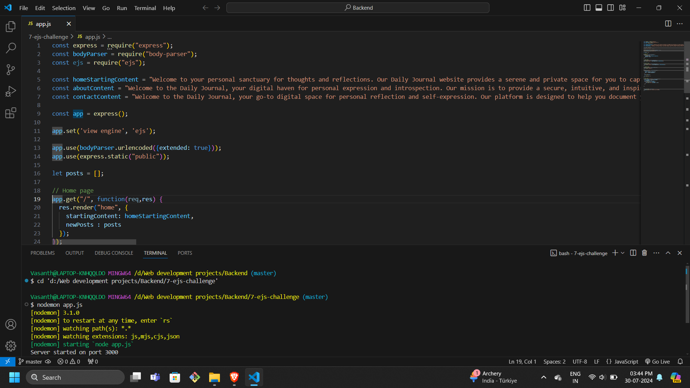
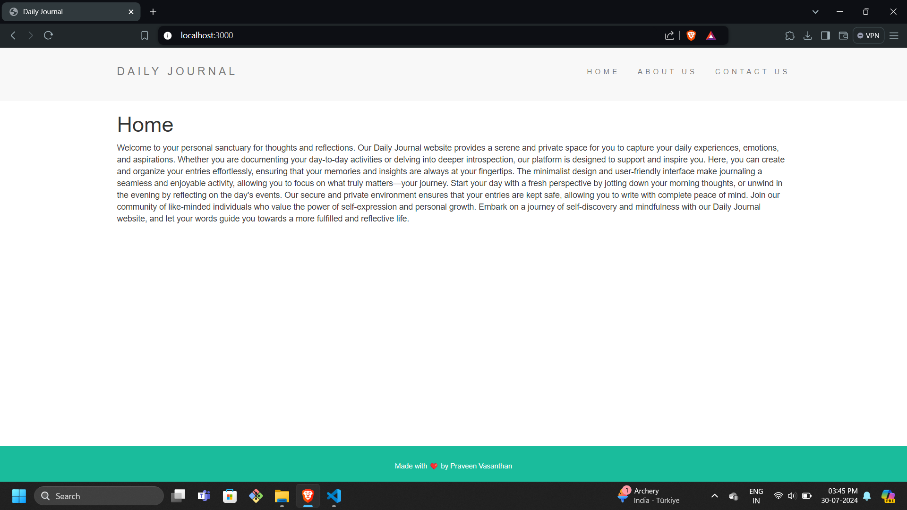
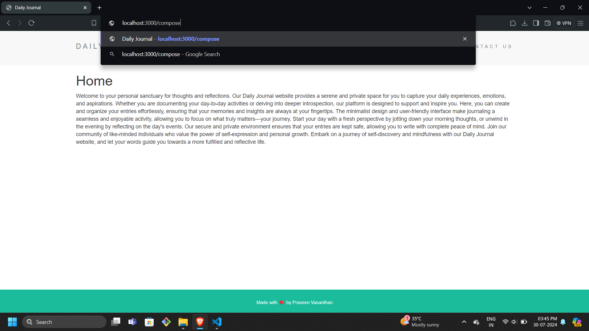
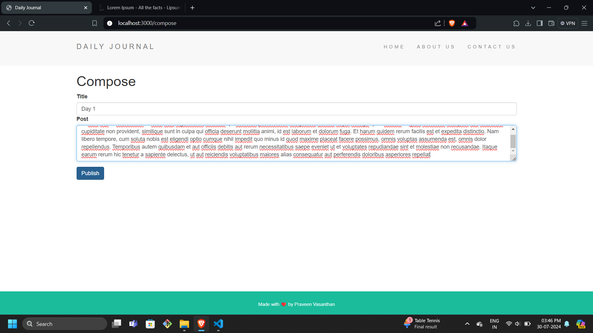
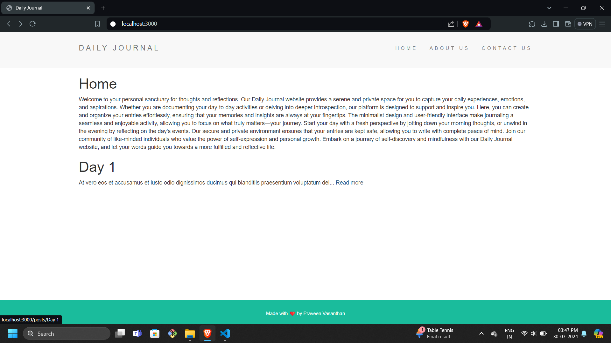
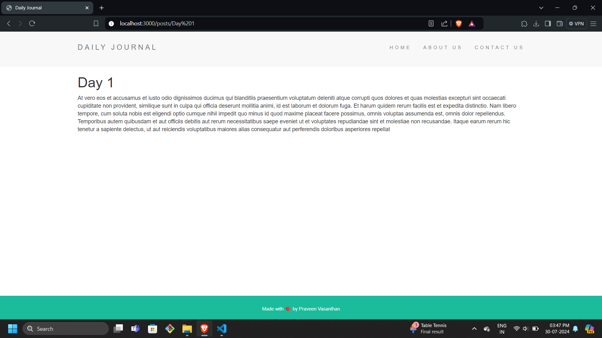

# Daily Journal Website

A simple daily journal website built using Node.js, Express, and EJS. This website allows users to write journal entries and view them. Users can also click on "Read More" to view the full content of a journal entry.

## Features

- Home page with navigation links
- About Us page
- Contact Us page
- Compose page for creating new journal entries
- Home page displays journal entries with "Read More" links
- Full content page for individual journal entries

## Installation

1. Clone the repository:
    ```bash
    git clone https://github.com/vasanth165/daily-journal.git
    ```
2. Navigate to the project directory:
    ```bash
    cd daily-journal
    ```
3. Install dependencies:
    ```bash
    npm install
    ```
4. Start the server:
    ```bash
    npm start
    ```

## Usage

1. Open your web browser and go to `http://localhost:3000`
2. Navigate through the pages using the links on the home page
3. To create a new journal entry, go to `http://localhost:3000/compose`
4. Enter the title and content of your journal entry and click "Publish"
5. The home page will display your new journal entry with a "Read More" link
6. Click "Read More" to view the full content of the journal entry

## Screenshots

### 1. Source Code


### 2. Home Page


### 3. Composing Page Path


### 4. Composing Page


### 5. Home Page with Journal Entry


### 6. Full Journal Entry

